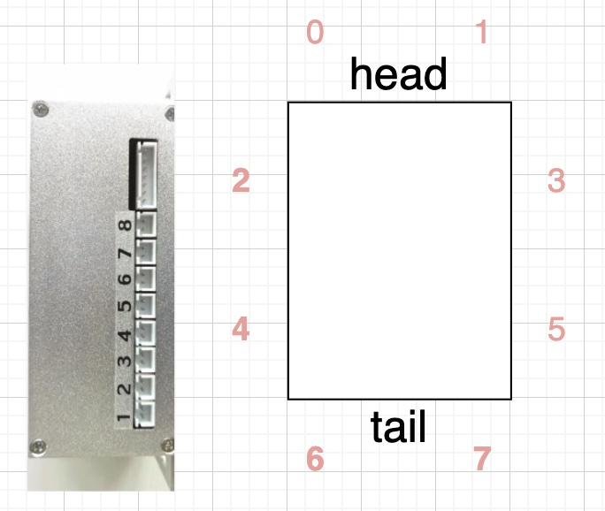
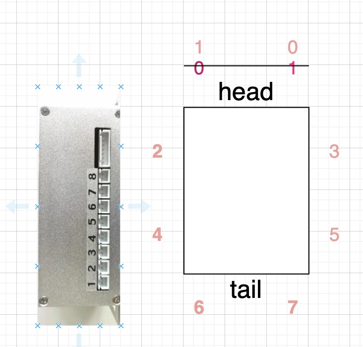
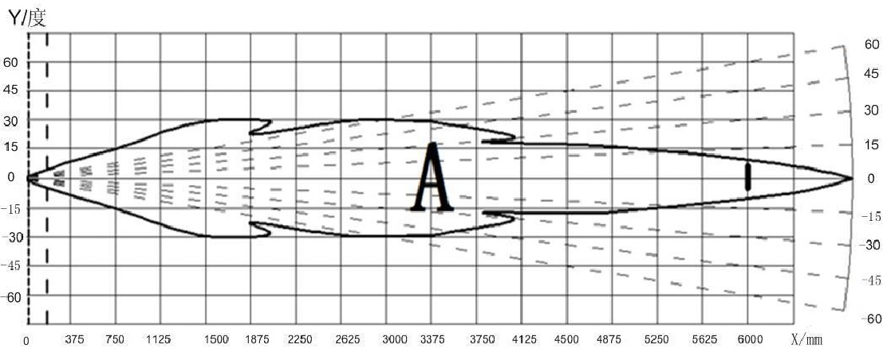

# 介绍
- 8-12探头超声波 F40-16TR

# 配置文件 - config.param.yaml
```yaml
order: [0, 1, 2, 3, 4, 5, 6, 7]                                 # order of detector 
field_of_view_radian: [0.52, 0.52, 0.52, 0.52, 0.52, 0.52, 0.52, 0.52] # radians
min_range_m: [0.2, 0.2, 0.2, 0.2, 0.2, 0.2, 0.2, 0.2]             # m
max_range_m: [2.0, 2.0, 2.0, 2.0, 2.0, 2.0, 2.0, 2.0]             # m
```
## order 字段
| Input                  | Data Type        | Explanation                            |
| ----------------------- | ---------------- | -----------                            |
| header | std_msgs/Header | header                   |
| 0号探头的数据 |`/sensing/ultra_sonic_radar/ultra_sonic_radar_0`<br>(`sensor_msgs::msg::Range`)|对应配置文件order字段下标0|
| 1号探头的数据 |`/sensing/ultra_sonic_radar/ultra_sonic_radar_1`<br>(`sensor_msgs::msg::Range`)|对应配置文件order字段下标1|
| 2号探头的数据 |`/sensing/ultra_sonic_radar/ultra_sonic_radar_2`<br>(`sensor_msgs::msg::Range`)|对应配置文件order字段下标2|
| 3号探头的数据 |`/sensing/ultra_sonic_radar/ultra_sonic_radar_3`<br>(`sensor_msgs::msg::Range`)|对应配置文件order字段下标3|
| 4号探头的数据 |`/sensing/ultra_sonic_radar/ultra_sonic_radar_4`<br>(`sensor_msgs::msg::Range`)|对应配置文件order字段下标4|
| 5号探头的数据 |`/sensing/ultra_sonic_radar/ultra_sonic_radar_5`<br>(`sensor_msgs::msg::Range`)|对应配置文件order字段下标5|
| 6号探头的数据 |`/sensing/ultra_sonic_radar/ultra_sonic_radar_6`<br>(`sensor_msgs::msg::Range`)|对应配置文件order字段下标6|
| 7号探头的数据 |`/sensing/ultra_sonic_radar/ultra_sonic_radar_7`<br>(`sensor_msgs::msg::Range`)|对应配置文件order字段下标7|

如果超声波安装位置没有正确，可以通过调整`config.param.yaml`order字段,让对应位置的超声波探头传出的对应的话题上

### 例如：
 - 0号探头和1号探头位置安装错误-order: [1, 0, 2, 3, 4, 5, 6, 7] 
 - 这样1号探头的数据还是以`/sensing/ultra_sonic_radar/ultra_sonic_radar_0`发布出来
 - 这样做的目的，主要是保证

注意点：至于探头的序号，根据超声波银色盒子标记(标记1对应0号探头)
## field_of_view_radian 字段



# 如何使用

## step-1 确保超声波探头的can信息 可以收到

```bash
# 0.5s一次的频率，发送b81fff, b8属于偶数，发一次超声波回复一次超声波数据

# 发送b71fff, b7属于奇数, 不间断返回数据
cansend can1 601#b11fff

# 查看超声波第1-4号探头数据
candump can1,611:7ff
```

## step-2 确保超声波技术指令生效

> 技术指令 就是偶数指令，发一次返回一次

```bash
# 20hz,注意需要发布频率大于0.05s,探头的返回频率才能稳定，否则不稳定
while true; do cansend can1 601#b21fff; sleep 0.051; done

# 查看两帧之间时间戳，单位s

# 查看601, 是否在0.05左右
candump -t d can1,601:7ff
# 查看611, 是否在0.05左右
candump -t d can1,611:7ff

```


## step-3 启动超声波

```bash
# 1.0 编译
colcon build --symlink-install --packages-select ultra_sonic_radar_driver
# 2.0 运行
source install/setup.bash 
ros2 launch ultra_sonic_radar_driver mc_radar_driver.launch.xml 
```


## step-2 设置超声波(可选)

> (可选) 默认模式是10hz 0xb1, 0x1f 0xff,需要修改工作方式和频率请执行下面命令

```bash
# 3.0 设置配置
ros2 run ultra_sonic_radar_driver configure_radar.sh <config_topic> <pub_rate> <work_mode>
```
- config_topic: 配置的话题
- pub_rate: 超声波的配置，0x601的发布频率
- work_mode: 超声波的工作模式, 不同的测距模式

例如: 按照20hz启动超声波

```bash
ros2 run ultra_sonic_radar_driver configure_radar.sh \
  /sensing/ultra_sonic_radar/activate_radar/input/configure_radar \
  19.9 \
  0xb2 \
  1
```

